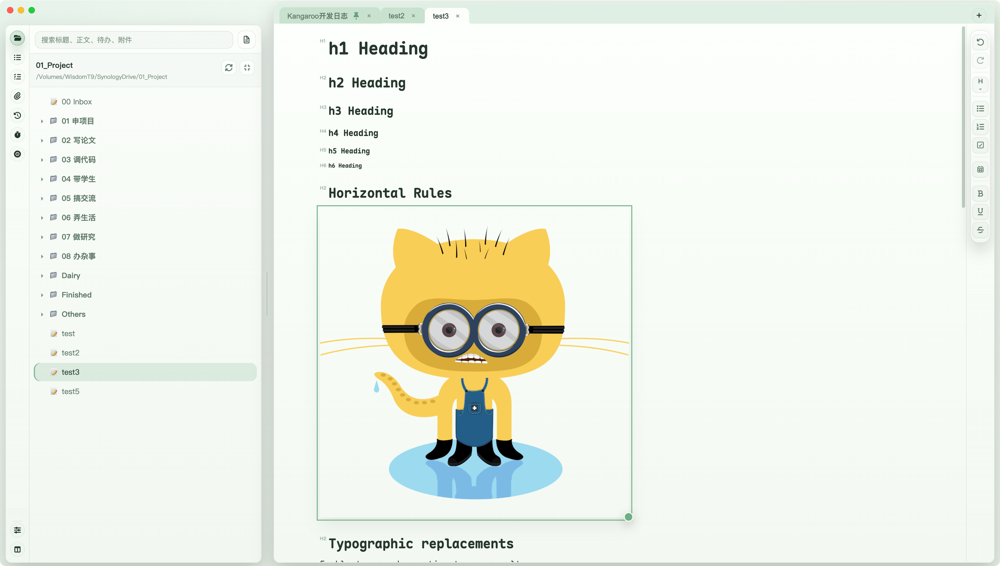

# Kangaroo

Kangaroo is a local-first TextBundle editor for writing, note-taking, attachments, and workspace-based organization.  
Kangaroo 是一款本地优先的 TextBundle 编辑器，适合写作、笔记、附件管理和基于工作空间的文档组织。



It is designed for people who want the portability of Markdown, the safety of plain files, and the convenience of a polished desktop note app.  
它面向希望同时获得 Markdown 可移植性、纯文件安全性，以及桌面笔记软件使用体验的用户。

## What Is Kangaroo? | Kangaroo 是什么？

Kangaroo is a desktop app built around the [TextBundle](https://textbundle.org/) format.  
Kangaroo 是一款围绕 [TextBundle](https://textbundle.org/) 格式构建的桌面应用。

Each note is stored as a `.textbundle` package:  
每篇笔记都会保存为一个 `.textbundle` 文档包：

- `text.markdown` stores the main document content  
  `text.markdown` 保存正文内容
- `assets/` stores images  
  `assets/` 保存图片
- `attachments/` stores files and folders linked from the note  
  `attachments/` 保存笔记中引用的文件和文件夹

This means your notes stay readable, portable, and easy to back up, while still supporting a modern editing experience.  
这意味着你的笔记依然是可读、可迁移、易备份的文件，同时又具备现代桌面编辑体验。

## Highlights | 功能亮点

- Local-first TextBundle editing  
  本地优先的 TextBundle 编辑
- WYSIWYG-style Markdown editing  
  所见即所得风格的 Markdown 编辑
- Workspace mode for managing many notes inside one folder  
  工作空间模式，可在一个文件夹中管理多篇笔记
- Tabbed editing, similar to a browser  
  类似浏览器的标签页编辑
- Outline, Todo, Attachment, and Workspace side panels  
  大纲、待办、附件、工作空间等侧边栏面板
- Todo checkboxes with keyboard shortcuts  
  支持快捷键的待办事项复选框
- Drag-and-drop support for images, files, and folders  
  支持拖拽图片、文件、文件夹
- Inline image display with direct resize handles  
  图片可在正文内显示并直接拖拽缩放
- Attachment cards with open, reveal, and delete actions  
  附件卡片支持打开、定位、删除
- Fast current-document and workspace-wide search  
  支持当前文档搜索与工作空间全局搜索
- Single-file HTML export  
  支持导出单文件 HTML
- Theme, typography, and editor spacing settings  
  支持主题、字体和编辑区间距设置
- macOS, Windows, and Linux packaging  
  提供 macOS、Windows、Linux 打包版本

## Core Features | 核心功能

### Writing | 写作

- Rich editing for headings, lists, todos, bold, underline, and strikethrough  
  支持标题、列表、待办、加粗、下划线、删除线等富文本编辑
- Toolbar actions for common formatting  
  工具栏可直接进行常用格式操作
- Shortcuts like `Cmd/Ctrl + 1..6` for heading levels  
  支持 `Cmd/Ctrl + 1..6` 快速设置不同级别标题
- `Cmd/Ctrl + T` to toggle todo items  
  支持 `Cmd/Ctrl + T` 快速切换待办事项
- Insert current date from the editor toolbar  
  可在工具栏中一键插入当前日期

### Images and Attachments | 图片与附件

- Paste or drag images directly into a note  
  可直接粘贴或拖拽图片进入笔记
- Images are stored in `assets/`  
  图片保存到 `assets/`
- Files and folders are stored in `attachments/`  
  文件和文件夹保存到 `attachments/`
- Double-click images to open them with the system  
  双击图片可调用系统默认应用打开
- Right-click images and links for context actions  
  图片和链接支持右键菜单操作
- Deleted attachments can be restored with undo during the current session  
  当前会话内删除的附件可通过撤销恢复

### Organization | 组织管理

- Open a folder as a workspace  
  可将一个文件夹作为工作空间打开
- Browse `.textbundle` notes in a file tree  
  可在目录树中浏览 `.textbundle` 笔记
- Create, rename, move, and delete notes and folders from the sidebar  
  可在侧边栏创建、重命名、移动、删除文档和文件夹
- Open multiple notes in tabs  
  支持多标签页打开多篇笔记
- Remember the last workspace automatically  
  自动记住上次打开的工作空间

### Tasks | 待办事项

- Dedicated Todo panel  
  独立的待办面板
- Sort todos by document order or completion status  
  可按文档出现顺序或完成状态排序
- Hide completed todos  
  可隐藏已完成待办
- Show todos from the current document or the entire workspace  
  可查看当前文档或整个工作空间中的待办
- Group workspace todos by folder and document  
  工作空间待办可按文件夹和文档分层分组

### Search | 搜索

- Search inside the current document  
  支持当前文档内搜索
- Toggle to workspace-wide search  
  可切换到工作空间全局搜索
- Search headings, body text, todos, and attachments  
  可搜索标题、正文、待办和附件
- Jump directly from results to the matching note and location  
  可从搜索结果直接跳转到对应文档和位置

### Export | 导出

- Export the current note as a single HTML file  
  可将当前笔记导出为单个 HTML 文件
- Images from `assets/` are embedded directly in the exported HTML  
  `assets/` 中的图片会直接内嵌到导出的 HTML 中
- Attachments are represented without copying the whole attachment folder  
  附件会以说明形式保留，不会复制整个附件目录

## Why TextBundle? | 为什么选择 TextBundle？

Kangaroo uses TextBundle because it gives you:  
Kangaroo 选择 TextBundle，是因为它同时提供了：

- Plain-text Markdown portability  
  纯文本 Markdown 的可移植性
- Better image and attachment management than a single `.md` file  
  比单个 `.md` 文件更好的图片与附件管理能力
- Easy sync with Git, cloud drives, and external tools  
  更容易与 Git、网盘和外部工具配合使用
- A format that remains useful even outside this app  
  即使离开这个应用仍然有价值的文件格式

## Platforms | 支持平台

Kangaroo is packaged for:  
Kangaroo 当前提供以下平台版本：

- macOS
- Windows
- Linux

Linux builds are produced for both:  
Linux 同时提供两个架构版本：

- `arm64`
- `amd64 / x64`

## Development | 开发说明

### Requirements | 环境要求

- Node.js
- npm

### Install | 安装依赖

```bash
npm install
```

### Run in Development | 开发运行

```bash
npm start
```

### Build Packages | 构建安装包

Build default packages:  
构建默认安装包：

```bash
npm run dist
```

Build Linux packages for both `arm64` and `x64`:  
同时构建 Linux 的 `arm64` 和 `x64` 安装包：

```bash
npm run dist:linux
```

## Project Structure | 项目结构

```text
.
├── main.js
├── renderer.js
├── wysiwyg-editor.js
├── index.html
├── build/
├── theme-assets/
└── dist/
```

- `main.js`: Electron main process and native integrations  
  `main.js`：Electron 主进程与系统原生集成
- `renderer.js`: app logic, workspace management, search, export, and UI coordination  
  `renderer.js`：应用逻辑、工作空间管理、搜索、导出与 UI 协调
- `wysiwyg-editor.js`: editor core integration and editing behavior  
  `wysiwyg-editor.js`：所见即所得编辑器核心与编辑行为
- `index.html`: app shell and styles  
  `index.html`：应用外壳与界面样式

## Current Focus | 当前状态

Kangaroo already covers the core workflow for:  
Kangaroo 目前已经覆盖以下核心工作流：

- writing  
  写作
- image handling  
  图片处理
- attachments  
  附件管理
- todos  
  待办事项
- workspace navigation  
  工作空间导航
- export  
  导出

Future work can continue in areas like performance tuning, publishing polish, and deeper knowledge-management features such as note linking and backlinks.  
后续可以继续在性能优化、发布打磨，以及双向链接、反向链接等更深层的知识管理能力上继续扩展。

## License | 许可证

This project is released under the MIT License.  
本项目基于 MIT License 发布。
